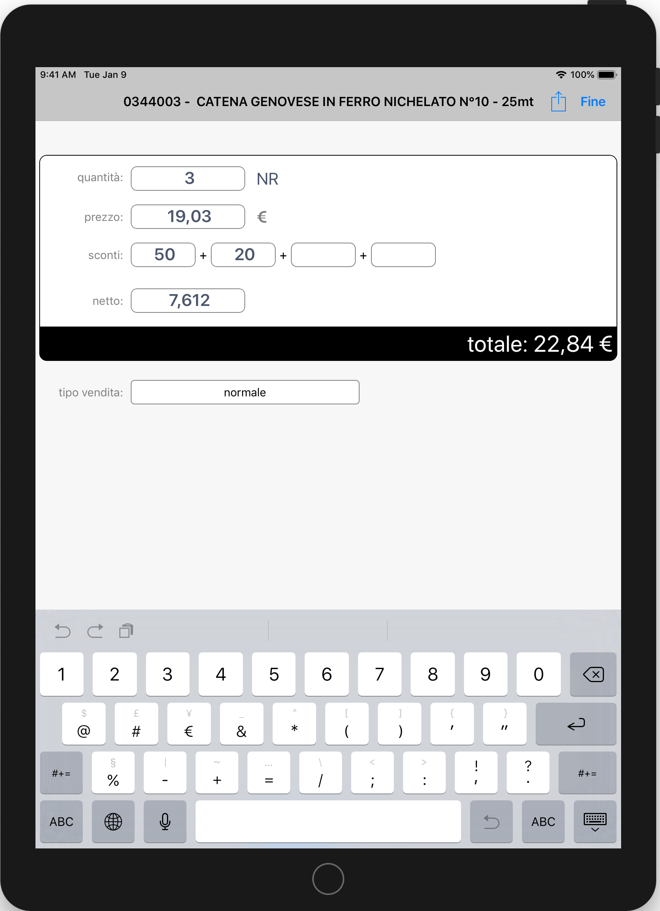
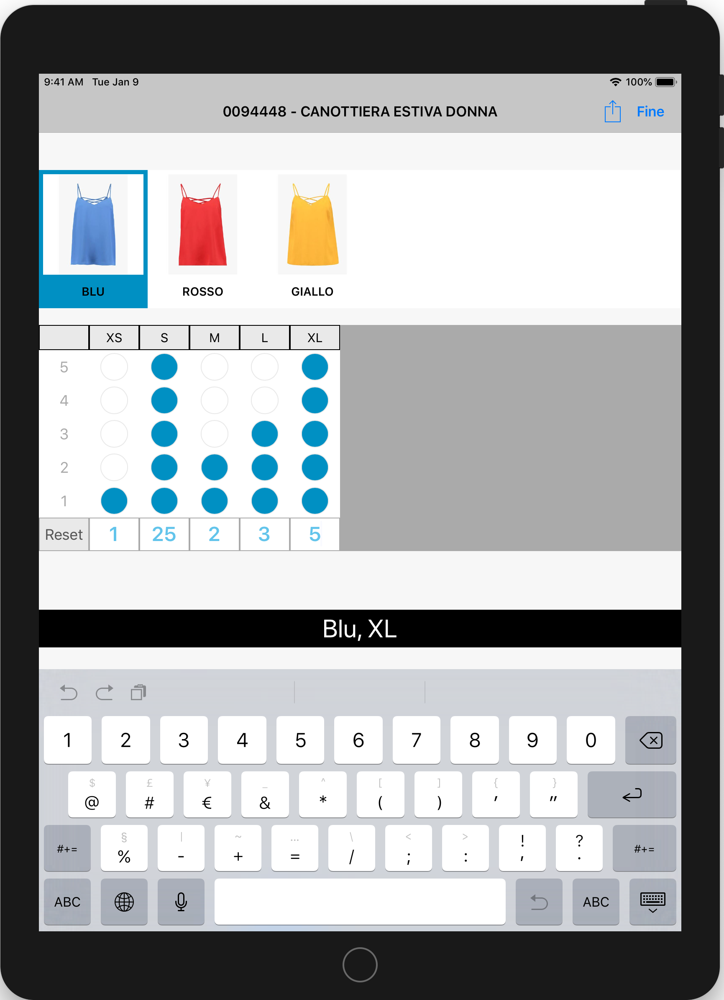

# Riga documento

Il corpo di un documento di vendita è composto da una o più righe.  
Le righe del documento sono create a partire dal catalogo articoli, ciascuna riga contiene le informazioni di vendita di un articolo.  
Per inserire una riga, dopo aver compilato i campi necessari nella testata del documento, si accede al catalogo tramite il pulsante "Aggiungi articoli".  
Le informazioni visualizzate in questo contesto sono personalizzate sulla base di una serie di parametri\(Cliente, Stagione, Marchio...\), pertanto la visualizzazione di uno stesso articolo sul catalogo potrebbe mostrare informazioni differenti e/o aggiuntive.

Per aggiungere una riga al documento eseguire tap sull'articolo desiderato: verrà aggiunta una riga al documento con la quantità di default \(configurabile attraverso le Business Rules "DocumentLine"\).  
Per accedere all'"Editor riga" è sufficiente eseguire il tap sull'articolo già presente nel documento.  
Nel catalogo gli articoli che sono già stati inseriti nel documento vengono evidenziati con uno stile differente.

La cancellazione di una riga può essere eseguita effettuando uno swipe da destra a sinistra.   
Se lo swipe è breve viene visualizzato il pulsante "Elimina", per eliminare effettuare tap sul pulsante "Elimina".  
L'operazione può essere velocizzata effettuando uno swipe da destra a sinistra più ampio.

### Editor riga

Le informazioni gestite in fase di editing della riga sono quelle referenziate nel layout [DocumentLineEditor](../../interfaccia-utente/sfa/layout/list/documentlineeditorcontext.md).  
Queste informazioni possono essere visualizzate in sola lettura oppure essere modificabili.  
I comportamenti dell'editor della riga documento possono essere modificati attraverso l'utilizzo di apposite [BusinessRules ](../../impostazioni/business-rules/)dell'entità DocumentLine.

### Editor riga articoli a variante

Per gli articoli che presentano delle varianti è disponibile un editor specifico.  
Questo editor visualizza una matrice per facilitare la selezione della combinazione di varianti dell'articolo.  
Dispone inoltre di un meccanismo semplificato per l'impostazione della quantità di vendita.  
La quantità può essere indicata con semplice tap in corrispondenza di uno dei valori proposti \(da 1 a 5\). La quantità può essere azzerata con un swipe dall'alto verso il basso nella colonna della combinazione di varianti. La quantità può comunque essere impostata digitandone il valore. 

### Editing veloce

In fase di aggiunta articoli al documento è possibile modificare la quantità di vendita senza accedere all'editor della riga.  
Questa funzionalità è accessibile se il layout è stato predisposto per visualizzare i tasti di editing quantità + e -.  
Per rendere visibili questi tasti aggiungere nell'apposito [layout ](../../interfaccia-utente/sfa/layout/list/itemssearchcontext.md)i field Document\_NumberOfPacksStepperMinus e Document\_NumberOfPacksStepperPlus per il contesto Document.Added. 

### Duplicazione riga / Nuova riga per lo stesso articolo

* Ruoli
* Spiegare come fare
* Spiegare i vantaggi sui prezzi indipendenti

