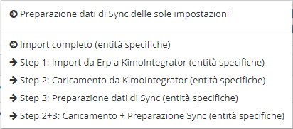

# Import/Export

## Come eseguire manualmente Import/Export

Il menù Import/Export è visibile nella parte in alto a destra dello schermo.

### Import

.png>)

* Importo completo: effettua i 3 step sotto riportati.&#x20;
* Step 1: Import da Erp a KimoIntegrator. I dati presenti nell'erp vengono importati nel database di KimoIntegrator.
* Step 2: Caricamento da KimoIntegrator. I dati presenti nel database di KimoIntegrator vengono caricati nel database di Kimo.
* Step 3: Preparazione dati di Sync. I dati presenti nel database di Kimo vengono preparati nel formato adatto ai client Kimo.
* Step 2+3: Caricamento +  Preparazione dati di Sync: esegue gli step 2 e 3.
* Importazione file immagini articoli: le immagini associate agli articoli vengono importate e copiate nella cartella \public
* Download immagini da url: i file relativi alle immagini degli articoli vengono scaricati dall'url specificata.
* Geocodifica Account: se è stato configurato l'utilizzo dell'API di Google per la geocodifica con questa funzionalità vengono recuperate le coordinate geografiche per tutti i Clienti e le Destinazioni merci presenti in Kimo.

### Import per entità

* Preparazione dati di Sync delle sole impostazioni: viene eseguita la preparazione di dati dei soli dati relativi alle impostazioni
* Import completo (entità specifiche): viene eseguita l'importazione completa delle sole entità specificate nella maschera proposta\
  &#x20;&#x20;
* Step 1: Import da Erp a KimoIntegrator (entità specifiche): viene eseguita l'importazione delle sole entità specificate nella maschera proposta
* Step 2: Caricamento da KimoIntegrator (entità specifiche): viene eseguito il caricamento delle sole entità specificate nella maschera proposta
* Step 3: Preparazione dati di Sync (entità specifiche): viene eseguita la preparazione dei dati di Sync delle sole entità specificate nella maschera proposta
* Step 2+3: Caricamento +  Preparazione dati di Sync (entità specifiche): vengono eseguiti gli step 2 e 3 per le sole entità specificate nella maschera proposta.

### Export

.png>)

* Export verso Erp: vengono inviati i dati da KimoIntegrator al sistema informativo.

###
