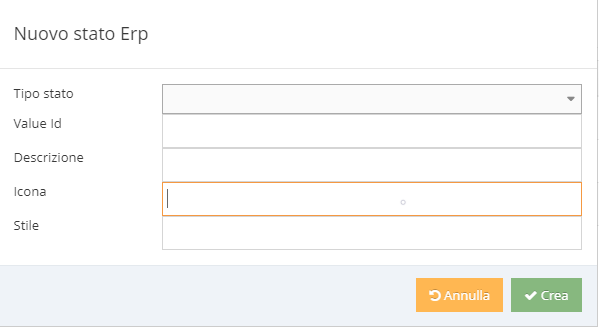

# Stati Erp

Una lista di stati erp è un elenco di coppie di valori: codice, descrizione in cui ciascuna coppia identifica uno stato.\
Ciascun stato erp ha un attributo "Tipo Stato" nella forma \<Entity>\<Index> che identifica l'Entity di riferimento ed il campo rispettivo Es. Item.ErpStatus1.\
Data un' entità con uno dei campi ErpStatus\<Index> valorizzato, se per ciascun valore del campo ErpStatus\<Index>, non è possibile determinare il valore corrispondente in stati erp, la fase di caricamento si interrompe con un errore.\
Per ciascun stato erp è possibile inoltre definire: lo stile (in formato CSS) e un codice che identifica l'icona da visualizzare (supporto a Font Awesome).

Es. Disponibilità Item

| Tipo Stato | Value Id | Descrizione     | Icona  | Anteprima                                                                 | Stile                                                           |
| ---------- | -------- | --------------- | ------ | ------------------------------------------------------------------------- | --------------------------------------------------------------- |
| Item1      | Rosso    | Non disponibile | \uf165 |  | color: #FF0000; font-family: FontAwesomeRegular; font-size: 20; |
| Item1      | Giallo   | In arrivo       | \uf107 |       | color: #FFD300; font-family: FontAwesomeRegular; font-size: 20; |
| Item1      | Verde    | Disponibile     | \uf164 |    | color: #009933; font-family: FontAwesomeRegular; font-size: 20; |
