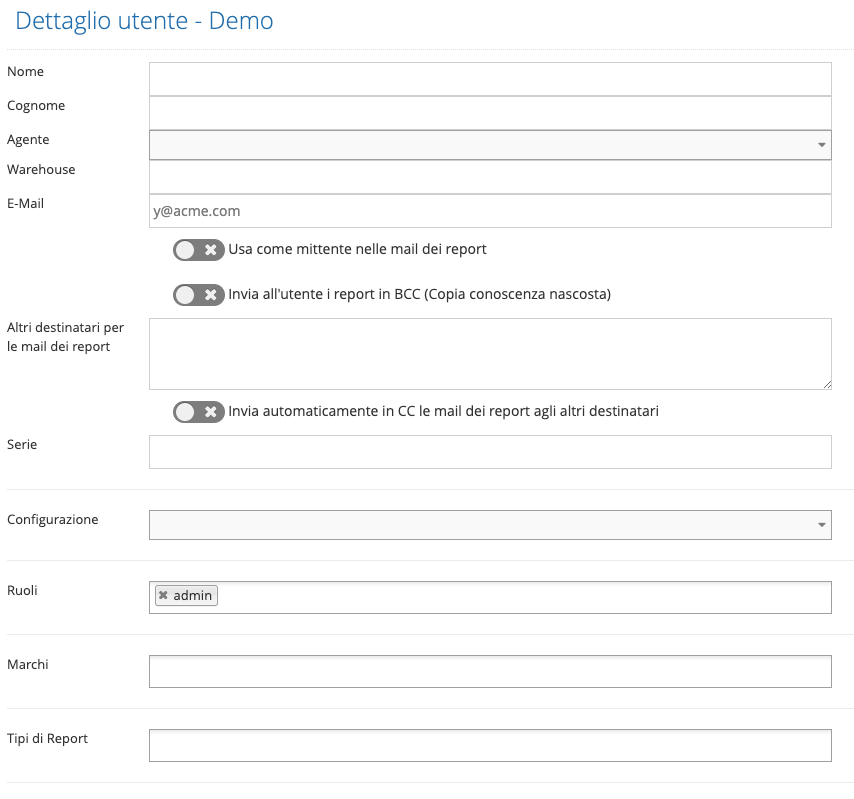

# Creare un utente di tipo Direzionale

Per creare un nuovo utente di tipo Direzionale, accedere alla [Console di Amministrazione](../../introduzione/moduli/console-admin.md), selezionare l'area "Utenti", quindi "Nuovo utente direzionale" e compilare tutti i campi nella maschera che viene visualizzata:

**Nota bene**

1. l'indirizzo mail deve essere univoco, in quanto è utilizzato per la conferma di attivazione dell'utente e può essere usato per funzioni come il reset della password.

Il campo "Ruolo" è da selezionare nell'elenco dei ruoli definiti in Kimo, necessari per abilitare le diverse funzionalità per l'utente \(vedi la sezione [Ruoli ](../ruoli.md)per la loro definizione\).

Una volta premuto il pulsante "Crea" viene creato l'utente ed inviata una mail all'indirizzo inserito nel campo "E-mail" contenente il link tramite cui impostare la password ed attivare l'utente.  
Fino a quando l'utente non è attivo non è possibile effettuare alcuna operazione.

Finché l'utente non è attivato nella lista utenti sono visibili i seguenti pulsanti  e  che  
permettono di inviare nuovamente la mail di attivazione oppure di accedere direttamente al link di attivazione \([Attivare un utente](attivazione-di-un-utente.md)\).

L'utente può essere "cancellato" premendo il tasto  \([Cancellare e ripristinare un utente](archiviazione-e-ripristino.md)\).

Successivamente alla creazione del nuovo utente, accedere alla maschera di dettaglio \(tramite il pulsantepresente nella lista degli utenti\) per impostare le ulteriori informazioni \(es. configurazione per i layout, serie numeratore, ...\) come da maschera seguente:

