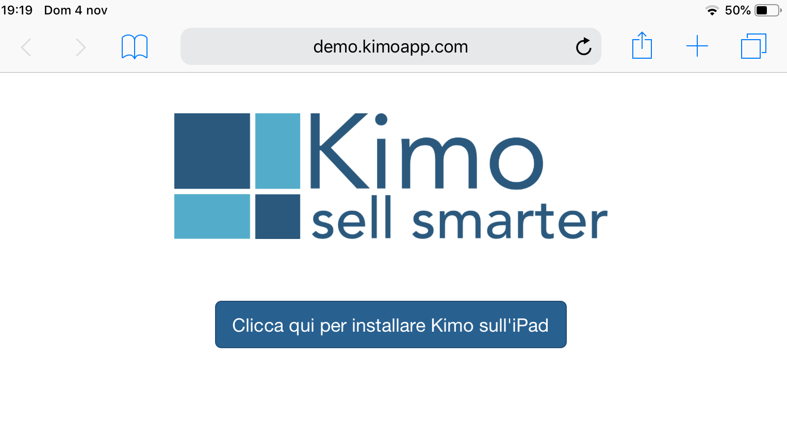

# Installare Kimo SFA su iPad

Per installare Kimo SFA su iPad:

1. Aprire dal browser Safari la pagina /setup del proprio ambiente, ad esempio  [https://kimo.acme.com/setup](https://demo.kimoapp.com/setup) \(nota: cambiare il link in base alla propria installazione\)
2. Si presenterà la seguente pagina web 

3. Fare tap sul pulsante **Clicca qui per installare Kimo sull'iPad** e fare tap su **Installa** nel successivo messaggio di installazione:

4.  Tornare alla pagina principale dell'iPad: l'app Kimo è in fase di installazione. Attendere che l'installazione sia completa \(comparirà l'icona di Kimo\). 

5.  Se si fa tap sull'icona di Kimo per avviare l'app, sarà mostrato il messaggio di sviluppatore interno non autorizzato:

6. Per procedere sarà sufficiente autorizzare "smart mobile" come sviluppatore, nelle impostazioni di iOS, seguendo gli step "Generali &gt; Gestione dispositivo &gt; smart mobile Srl &gt; autorizza".

7.  Tornare nel menù iniziale di iOS e avviare l'app di Kimo: si presenterà la maschera iniziale, nella quale inserire le credenziali \(nome utente e password\) e l'indirizzo del server \(es. [https://kimo.acme.com](https://demo.kimoapp.com/)  - cambiare il link in base alla propria installazione\)

8.  Inserite le credenziali, fare tap sul pulsante **Crea profilo** per avviare la prima sincronizzazione.  
Al termine sarà possibile confermare o meno l'utilizzo del "Touch ID" o del "Face ID" per il login \(impostazione modificabile anche successivamente, nel menù Impostazioni\).

9. Questa prima sincronizzazione ha scaricato solamente i dati dell'utente, ignorando i file \(es. immagini degli articoli, PDF, ...\). Questo per far sì che l'utente possa operare su Kimo il prima possibile, anche in assenza di questi file.  
Per scaricare i file, eseguite una nuova sincronizzazione dal menù Sincronizza.

